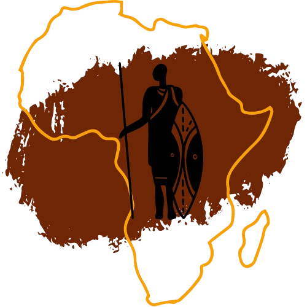

Category: Forensics 

Points: 345

Author: foundhack
### Description
**Agent 47** and Diana have been tirelessly searching for what shifted in the shadows. Perhaps Agent 46 holds the key. Uncover the change and recover the flag.

Flag format : `SADC{...}`

---
### File
[Agent47](https://drive.google.com/file/d/1daLezRr_rjkVb1MVzBxEQpmpFpH5fdjt/view?usp=drive_link)

---
### Solution
After some analysis, I noticed that each pair of bytes in the file has been swapped. 


I used `dd` to reverse the initial operation made on the file.


```sh
dd if=Agent47 of=Agent47.png conv=swab
```

I got this image.



After some steg analysis, I found a corrupted chunk on the `Agent47.png` with `pngcheck`


To extract the corrupted chunk, we need his offset and is lenght. We can know it with `pngcheck -v`.


Let's extract it : 

```sh
tail -c +$((0x2e139 + 5240)) Agent47.png > corrupted.bin
```


We can input the `corrupted.bin` to [CyberChef](https://cyberchef.org) and decode it with the `ROT47 Brute force` recipe.


Holy steg !

Flag: `BattleCTF{Jo1n_the_4dv3nture_in_4fric@!58963}`

GG!