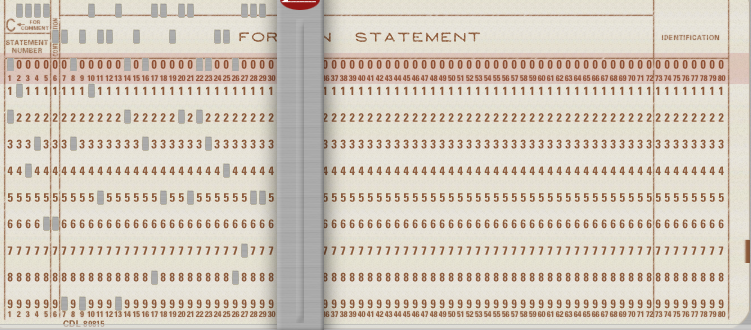

Category: 

Points: Flag format : SADC{.....} 

Author : [BJ SEC](https://bjsec.xyz)

### Description
Flag format : SADC{.....}

---
### File
[image.png](https://drive.google.com/file/d/1My_E8alScRaybRQgqa93ydRRVACssLXx/view?usp=drive_link)

---
### Solution
Fist, we need to download the `image.png`.  It looks like this :

With a quick research with google lens, we understand that it is a `IBM punch card`.
I tried some scripts and tools to convert the punched holes to strings but nothing worked so
I searched for a `IBM punch card simulator` on google and I found this site : [KEYPUNCH](https://www.masswerk.at/keypunch/). I also found a repo that had an image allowing me to manually, yes MANUALLY match the punched holes with their corresponding characters. 

The link to the image : https://github.com/tachoknight/punchcardreader/blob/master/punchcard.jpg

Not my proudest solve 😭🤡.

Flag :  `SADC{FORTRAN-IS-THE-BEST-MYGEE}`

GG!